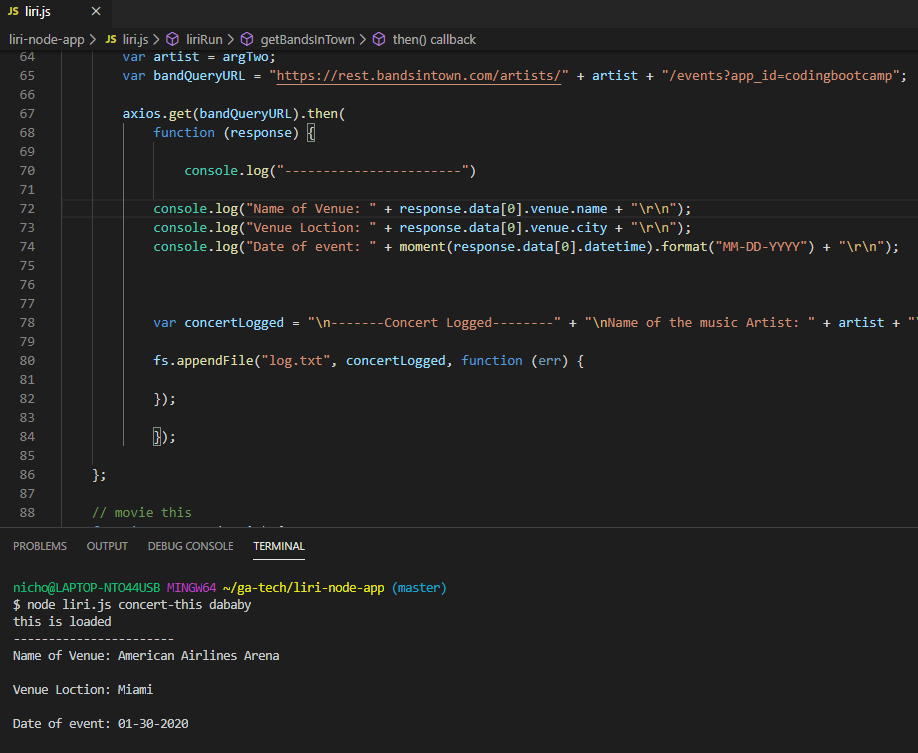
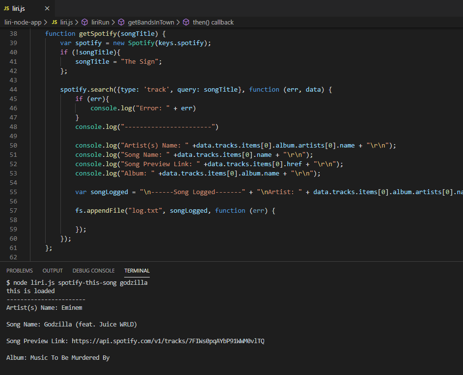
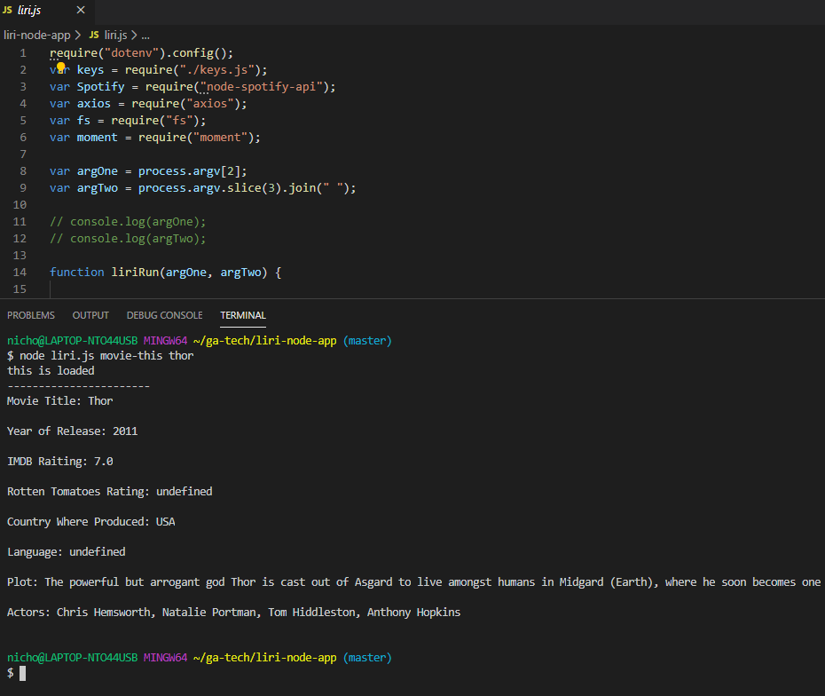
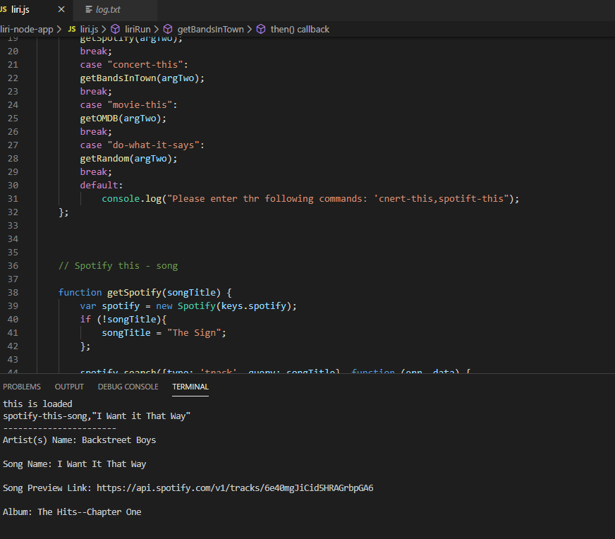
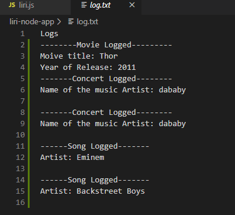

# liri-node-app


Purpose:

 Make it so liri.js can take in one of the following commands:

   * `concert-this`

   * `spotify-this-song`

   * `movie-this`

   * `do-what-it-says`

### What Each Command Should Do

1. `node liri.js concert-this <artist/band name here>`

     * Name of the venue

     * Venue location

     * Date of the Event (use moment to format this as "MM/DD/YYYY")

    


     2. `node liri.js spotify-this-song '<song name here>'`

   * This will show the following information about the song in your terminal/bash window

     * Artist(s)

     * The song's name

     * A preview link of the song from Spotify

     * The album that the song is from

   * If no song is provided then your program will default to "The Sign" by Ace of Base.

   

   


   3. `node liri.js movie-this '<movie name here>'`

   * This will output the following information to your terminal/bash window:

     ```
       * Title of the movie.
       * Year the movie came out.
       * IMDB Rating of the movie.
       * Rotten Tomatoes Rating of the movie.
       * Country where the movie was produced.
       * Language of the movie.
       * Plot of the movie.
       * Actors in the movie.
     ```

   * If the user doesn't type a movie in, the program will output data for the movie 'Mr. Nobody.'

     * If you haven't watched "Mr. Nobody," then you should: <http://www.imdb.com/title/tt0485947/>

     

     4. `node liri.js do-what-it-says`

   * Using the `fs` Node package, LIRI will take the text inside of random.txt and then use it to call one of LIRI's commands.

     * It should run `spotify-this-song` for "I Want it That Way," as follows the text in `random.txt`.

     * Edit the text in random.txt to test out the feature for movie-this and concert-this.



* Your results are logged in the `log.txt` file. 




## Sketch


